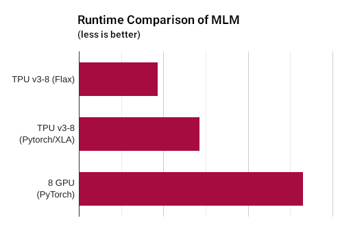
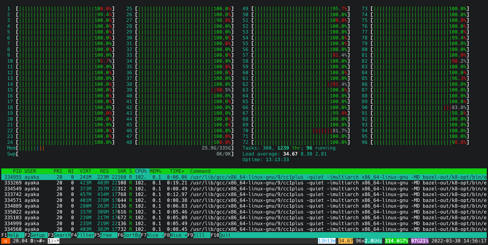
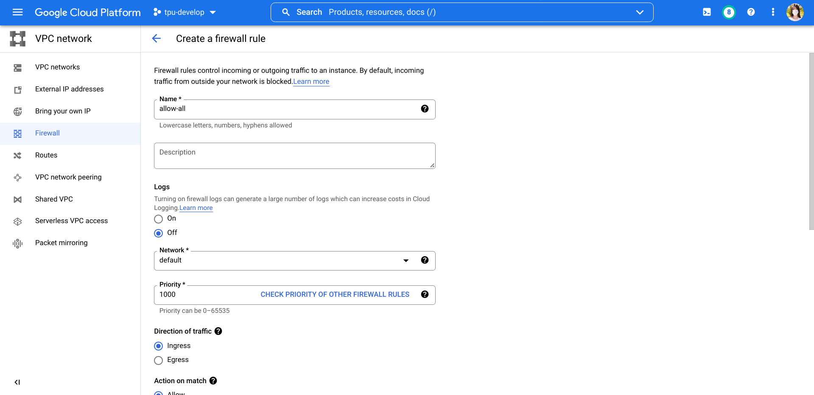
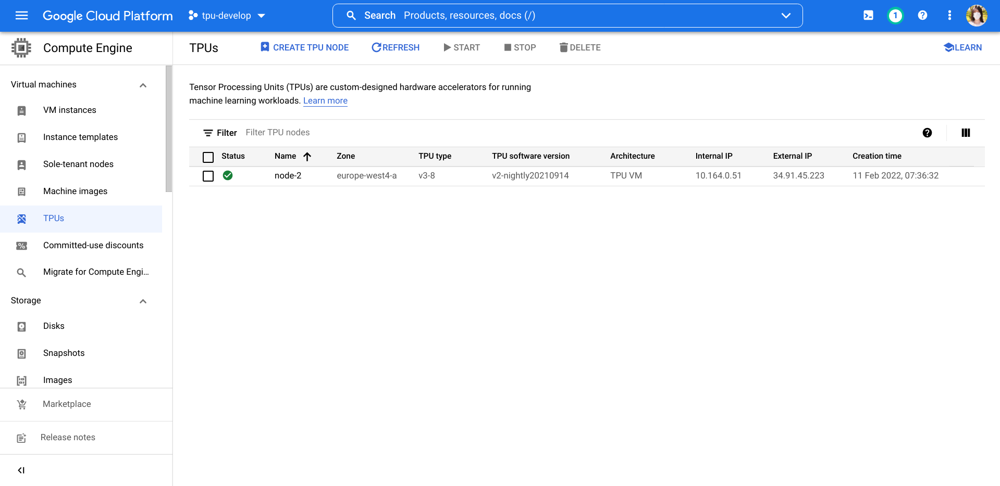
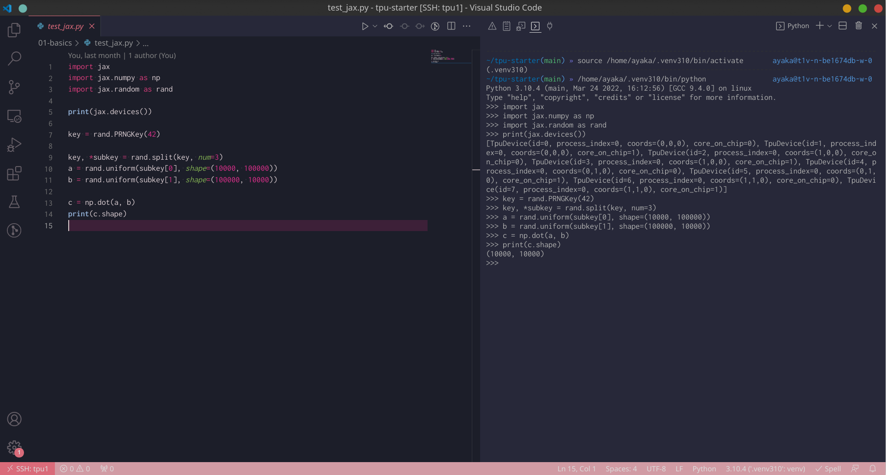

# TPU Starter
원작자의 허락을 맡고 번역하는 저장소로, 영어가 편하다면 원작자의 저장소를 참고하시면 좋습니다  

Google Cloud TPU에 대한 모든 것

* [1. 커뮤니티](#1-community)
* [2. TPU 소개](#2-introduction-to-tpu)
    * [2.1. TPU를 사용하는 이유?](#21-why-tpu)
    * [2.2. TPU를 많은 사람들이 사용하지 않는 이유?](#22-tpu-is-so-good-why-havent-i-seen-many-people-using-it)
    * [2.3. TPU, 좋은건 알겠는데 실제로 소유할 수 있을까?](#23-i-know-tpu-is-good-now-can-i-touch-a-real-tpu)
    * [2.4. TPU에 액세스 하는 방법?](#24-how-do-i-get-access-to-tpu)
    * [2.5. TPU instance를 만들어야 한다구? 그게 뭔데?](#25-what-does-it-mean-to-create-a-tpu-instance-what-do-i-actually-get)
* [3. TRC Program 소개](#3-introduction-to-the-trc-program)
    * [3.1. TRC program 신청방법?](#31-how-to-apply-for-the-trc-program)
    * [3.2. 정말 공짜야?](#32-is-it-really-free)
* [4. TPU VM Instance 만들기](#4-create-a-tpu-vm-instance)
    * [4.1. VPC firewall 수정](#41-modify-vpc-firewall)
    * [4.2. instance 만들기](#42-create-the-instance)
    * [4.3. 서버에 SSH 접속하기](#43-ssh-to-the-server)
* [5. 환경 설정](#5-environment-setup)
* [6. 개발 환경 설정](#6-development-environment-setup)
    * [6.1. Mosh and Byobu 설치](#61-set-up-mosh-and-byobu)
    * [6.2. VSCode Remote-SSH 설치](#62-set-up-vscode-remote-ssh)
    * [6.3. TPU 작동 확인하는 방법?](#63-how-can-i-verify-that-the-tpu-is-working)
* [7. JAX 기초](#7-jax-basics)
    * [7.1. JAX를 사용하는 이유?](#71-why-jax)
    * [7.2. Parallelism](#72-parallelism)
        * [7.2.1. jax.pmap 기본](#721-basics-of-jaxpmap)
        * [7.2.2. update function에 무작위성을 얻고 싶다면?](#722-what-if-i-want-to-have-randomness-in-the-update-function)
        * [7.2.3. update function에 optax optimizers를 사용하고 싶다면?](#723-what-if-i-want-to-use-optax-optimizers-in-the-update-function)
    * [7.3. 특정 모델 파라미터 고정](#73-freeze-certain-model-parameters)
    * [7.4. 허깅페이스 트랜스포머와 통합하기](#74-integration-with-hugging-face-transformers)
    * [7.5. What is a[:, None]?](#75-what-is-a-none)
* [8. TPU 사용 모범 사례](#8-tpu-best-practices)
    * [8.1. Google Colab 보다 Google Cloud Ploatform](#81-prefer-google-cloud-platform-to-google-colab)
    * [8.2. TPU node 보다 TPU VM ](#82-prefer-tpu-vm-to-tpu-node)
    * [8.3. TPU VM에서 주피터 노트북 실행](#83-run-jupyter-notebook-on-tpu-vm)
    * [8.4. TPU VM instances끼리 file 공유](#84-share-files-across-multiple-tpu-vm-instances)
    * [8.5. TPU 사용 모니터링](#85-monitor-tpu-usage)
    * [8.6. TPU VM server 시작하기](#86-start-a-server-on-tpu-vm)
* [9. JAX 사용 모범 사례](#9-jax-best-practices)
    * [9.1. Import convention](#91-import-convention)
    * [9.2. JAX random keys 관리](#92-manage-random-keys-in-jax)
    * [9.3. 모델 파라미터 시리얼라이즈](#93-serialize-model-parameters)
    * [9.4. NumPy arrays 와 JAX arrays 변환](#94-convertion-between-numpy-arrays-and-jax-arrays)
    * [9.5. PyTorch tensors 와 JAX arrays 변환](#95-convertion-between-pytorch-tensors-and-jax-arrays)
    * [9.6. 타입 어노테이션](#96-type-annotation)
    * [9.7. NumPy array , a JAX array 여부 확인하기](#97-check-if-an-array-is-either-a-numpy-array-or-a-jax-array)
    * [9.8. 중첩 딕셔너리 구조에서 모든 파라미터 shape 확인](#98-get-the-shapes-of-all-parameters-in-a-nested-dictionary)
    * [9.9. CPU에서 무작위 숫자 생성하는 올바른 방법](#99-the-correct-way-to-generate-random-numbers-on-cpu)
    * [9.10. Optax로 optimizers 사용하기](#910-use-optimizers-from-optax)
    * [9.11. Optax로 크로스엔트로피 loss 사용하기](#911-use-the-cross-entropy-loss-implementation-from-optax)
* [10. Pods 사용하기](#10-working-with-pods)
    * [10.1. NFS를 사용해 공유 디렉토리 만들기](#101-create-a-shared-directory-using-nfs)
    * [10.2. 모든 TPU Pods에서 동시에 command 실행하기](#102-run-a-command-simultaneously-on-all-tpu-pods)
* [11. 일반적인 문제들](#11-common-gotchas)
    * [11.1. TPU machine의 External IP가 빈번하게 바뀌는 현상](#111-external-ip-of-tpu-machine-changes-occasionally)
    * [11.2. 1개 TPU device는 1개 프로세스만 사용가능](#112-one-tpu-device-can-only-be-used-by-one-process-at-a-time)
    * [11.3. 여러 프로그램과 충돌나는 TCMalloc](#113-tcmalloc-breaks-several-programs)
    * [11.4. TPU를 위한 nvidia-smi 대체프로그램이 없음](#114-there-is-no-tpu-counterpart-of-nvidia-smi)
    * [11.5. 다른 프로세스에 의해 libtpu.so가 사용중인 현상](#115-libtpuso-already-in-used-by-another-process)
    * [11.6. fork 방식의 multiprocessing을 지원하지 않는 JAX](#116-jax-does-not-support-the-multiprocessing-fork-strategy)

<!-- Created by https://github.com/ekalinin/github-markdown-toc -->

이 프로젝트는 [Cloud Run FAQ](https://github.com/ahmetb/cloud-run-faq)에 영감을 받아서 만들어졌으며, 커뮤니티 기반으로 관리하는 Google Cloud의 기술 자료입니다.

## 1. 커뮤니티

2022 2. 23을 기준으로 Cloud TPUs 관련 공식 대화 채널은 존재하지 않으나, 텔레그램 채널 [@cloudtpu](https://t.me/cloudtpu)이나, 디스코드 채널 [TPU Podcast](https://github.com/shawwn/tpunicorn#ml-community)에 참여할 수 있습니다.  
여기엔 TRC Cloud TPU v4 유저가 그룹안에 있습니다


## 2. TPU 소개

### 2.1. TPU를 사용하는 이유?

**한줄요약**: GPU가 CPU를 대체하듯, TPU는 GPU를 대체할 수 있습니다

TPU는 머신러닝을 위해 설계된 특별한 하드웨어 입니다. Huggingface Transforemrs 퍼포먼스를 참고할 수 있습니다.  
[performance comparison](https://github.com/huggingface/transformers/blob/main/examples/flax/language-modeling/README.md#runtime-evaluation):



게다가 [the TRC program](https://sites.research.google/trc/about/)은 연구자들을 위해 free TPU를 제공합니다. 제가 아는 한 모델을 학습할 때 컴퓨팅 리소스를 고민해본 적이 있다면 이게 가장 최적의 해결책입니다.  
자세한 내용은 아래에 TRC program의 내용을 참고하세요.  


### 2.2. TPU를 많은 사람들이 사용하지 않는 이유?

만약 Pytorch를 사용한다면, TPU는 적합하지 않을 수 있습니다. TPU는 Pytorch에서 제대로 지원되지 않습니다. 제 실험으로 비춰봤을 때, 1개 batch가 cpu에서 14초가 걸린 반면 TPU에선 4시간이 넘게 걸렸습니다.  
트위터 유저 @mauricetpunkt 또한 [TPU에서 Pytorch 퍼포먼스가 좋지 않다고 했습니다.](https://twitter.com/mauricetpunkt/status/1506944350281945090).  
  
추가적인 문제로, 1개의 TPU v3-8은 8개 코어로(각 16GB memory) 이뤄져있으며, 이걸 전부 사용하려면 부가적인 코드를 사용해야 합니다. 그렇지 않으면 1개 코어만 사용됩니다.

### 2.3. TPU, 좋은건 알겠는데 실제로 소유할 수 있을까?
  
불행히도 TPU를 물리적으로 가질 순 없고, 클라우드 서비스를 활용해야만 가능합니다.  

### 2.4. TPU에 액세스 하는 방법?

TPU 인스턴스를 [Google Cloud Platform](https://cloud.google.com/tpu)에서 생성할 수 있습니다. 자세한 정보는 아래를 참고하세요.

[Google Colab](https://colab.research.google.com/)을 사용할 수 있지만, 별로 추천하진 않습니다. 게다가 [TRC program](https://sites.research.google/trc/about/)을 통해 무료로 TPU를 받게 된다면 코랩보단 Google Cloud Platform을 사용하게 될겁니다.

### 2.5. TPU instance를 만들어야 한다구? 그게 뭔데?

TPU v3-8 인스턴스를 [Google Cloud Platform](https://cloud.google.com/tpu)에서 만들면, Ubuntu 20.04 cloud server에 슈퍼유저 권한을 가지게 되며, 96개 코어, 335GB 메모리, 그리고 TPU 장비 1개(8개코어, 128GB vram)를 받게 됩니다



TPU는 우리가 GPU를 쓰는 방법과 유사합니다. 대부분 우리가 GPU를 사용할 때 GPU가 딸린 리눅스 서버를 사용하듯이 사용하면 됩니다. 단지 그 GPU가 TPU와 연결된 것 뿐입니다

## 3. TRC Program 소개

### 3.1. TRC program 신청방법?

[homepage](https://sites.research.google/trc/about/)의 내용이 있지만서도, Shawn이 TRC program에 대해서 [google/jax#2108](https://github.com/google/jax/issues/2108#issuecomment-866238579)에 상세하게 써두었습니다. TPU에 관심있다면 바로 읽는게 좋습니다.

### 3.2. 정말 공짜야?

첫 3달 동안 완전히 무료로 사용할 수 있으며 이후 한달에 HK$13.95, US$1.78정도를 사용하는데 이건 인터넷 트래픽에 대한 outbound 비용입니다.


## 4. TPU VM Instance 만들기

### 4.1. VPC firewall 수정

Mosh나 기타 프로그램이 막히지 않도록 방화벽의 제한을 완화해야 합니다.  

VPC network에 있는 [Firewall management page](https://console.cloud.google.com/networking/firewalls/list)를 여세요

새로운 방화벽 규칙 생성을 위해 버튼 클릭.



이름을 allow-all로 명명하고, target은 All instances in the network, source filter는 0.0.0.0/0, protocols and prots를 allow all로, 이후 생성 버튼을 클릭합니다.

대외비 데이터셋을 사용하거나, 높은 수준의 보안이 필요한 사용자는 더 엄격하게 방화벽 규칙을 적용하는 것이 좋습니다.

### 4.2. instance 만들기

[Google Cloud Platform](https://cloud.google.com/tpu)페이지에 들어간 후, 네비게이터 메뉴에서 [TPU management page](https://console.cloud.google.com/compute/tpus)에 들어갑니다.



우측 상단에 있는 Cloud Shell 콘솔 버튼을 누릅니다.(클라우드 쉘 실행)

Cloud Shell에서 Cloud TPU VM v3-8을 만들기 위해 아래의 명령어를 command 창에 입력합니다
(버전은 변경 가능)

```sh
gcloud alpha compute tpus tpu-vm create node-1 --project tpu-develop --zone europe-west4-a --accelerator-type v3-8 --version v2-nightly20210914
```

만약 명령어 실행이 실패하면 TPU가 모두 점유중인 것으로, 다시 실행합니다

gcloud 커맨드를 로컬 머신에 설치하면 Cloud shell을 열어 커맨드를 실행하는거보다 더 편합니다.

TPU Pod을 만들려면 아래의 명령어를 실행하세요.

```sh
gcloud alpha compute tpus tpu-vm create node-3 --project tpu-advanced-research --zone us-central2-b --accelerator-type v4-16 --version v2-alpha-tpuv4
```

### 4.3. 서버에 SSH 접속하기

TPU VM에 SSH로 접속:

```sh
gcloud alpha compute tpus tpu-vm ssh node-1 --zone europe-west4-a
```

TPU Pods중 하나에 SSH 접속:

```sh
gcloud alpha compute tpus tpu-vm ssh node-3 --zone us-central2-b --worker 0
```

## 5. 환경 설정

`setup.sh`에 아래의 스크립트를 저장 후 실행하세요 .

```sh
gcloud alpha compute tpus tpu-vm ssh node-2 --zone us-central2-b --worker all --command '

# Confirm that the script is running on the host
uname -a

# Install common packages
export DEBIAN_FRONTEND=noninteractive
sudo apt-get update -y -qq
sudo apt-get upgrade -y -qq
sudo apt-get install -y -qq golang neofetch zsh mosh byobu aria2

# Install Python 3.10
sudo apt-get install -y -qq software-properties-common
sudo add-apt-repository -y ppa:deadsnakes/ppa
sudo apt-get install -y -qq python3.10-full python3.10-dev

# Install Oh My Zsh
sh -c "$(curl -fsSL https://raw.githubusercontent.com/ohmyzsh/ohmyzsh/master/tools/install.sh)" "" --unattended
sudo chsh $USER -s /usr/bin/zsh

# Change timezone
# timedatectl list-timezones  # list timezones
sudo timedatectl set-timezone Asia/Hong_Kong  # change to your timezone

# Create venv
python3.10 -m venv $HOME/.venv310
. $HOME/.venv310/bin/activate

# Install JAX with TPU support
pip install -U pip
pip install -U wheel
pip install -U "jax[tpu]" -f https://storage.googleapis.com/jax-releases/libtpu_releases.html

'
```

이 스크립트는 `~/.venv310` 가상환경을 생성하기 때문에 가상환경을 활성화 할 때 `. ~/.venv310/bin/activate` 명렁어를 사용하거나, `~/.venv310/bin/python`를 통해 파이썬 인터프리터를 호출하면 됩니다.

이 레포를 clone한 뒤에 레포의 root 디렉토리에서 실행하세요.

```sh
pip install -r requirements.txt
```

## 6. 개발 환경 설정

### 6.1. Mosh and Byobu 설치

서버에 SSH를 통해 다이렉트로 접속하면 연결이 끊길 위험이 발생합니다.
접속이 끊기면 학습하던 프로세스는 강제로 종료되버립니다.

[Mosh](https://mosh.org/) 와 [Byobu](https://www.byobu.org/)는 이런 문제를 해결합니다.
Byobu는 연결이 끊기더라도 스크립트가 서버에서 계속 동작할 수 있도록 보장하며, Mosh는 접속이 끊기지 않는 부분을 보장합니다.

Mosh를 로컬에 설치하고, 아래 스크립트를 통해 login 하세요.

```sh
mosh tpu1 -- byobu
```

Byobu 참고 영상[Learn Byobu while listening to Mozart](https://youtu.be/NawuGmcvKus).

### 6.2. VSCode Remote-SSH 설치

VSCode를 실행 후 'Extensions' 탭에서 'Remote-SSH'를 설치하세요

<kbd>F1</kbd>을 눌러 커맨드창을 실행 후 'ssh'를 타이핑 후 'Remote-SSH: ...를 선택 후 연결하고자 하는 서버의 정보를 입력하고 엔터를 치세요.

VScode가 서버에 설치되기까지 기다리고나면 VSCode를 사용해 서버에서 개발할 수 있습니다.




### 6.3. TPU 작동 확인하는 방법?

아래 명령어 실행:

```sh
~/.venv310/bin/python -c 'import jax; print(jax.devices())'  # should print TpuDevice
```

TPU Pods의 경우, 아래 명령어를 로컬에서 실행하세요:

```sh
gcloud alpha compute tpus tpu-vm ssh node-2 --zone us-central2-b --worker all --command '~/.venv310/bin/python -c "import jax; jax.process_index() == 0 and print(jax.devices())"'
```

## 7. JAX 기초

### 7.1. JAX를 사용하는 이유?

JAX는 차세대 딥러닝 라이브러리로, TPU에 대한 지원이 매우 잘됩니다.  
JAX에 대한 내용으로 공식 튜토리얼을 확인해보세요.[tutorial](https://jax.readthedocs.io/en/latest/jax-101/index.html).

### 7.2. Parallelism

#### 7.2.1. `jax.pmap` 기본

4가지 키 포인트

1\. `params` 와 `opt_state` 는 디바이스간에 복제되어야 합니다.

```python
replicated_params = jax.device_put_replicated(params, jax.devices())
```

2\. `data` 와 `labels` 디바이스간에 나뉘어야 합니다.

```python
n_devices = jax.device_count()
batch_size, *data_shapes = data.shape
assert batch_size % n_devices == 0, 'The data cannot be split evenly to the devices'
data = data.reshape(n_devices, batch_size // n_devices, *data_shapes)
```

3\. `jax.pmap`과 함께 타겟 함수를 데코레이션에 사용하세요

```
@partial(jax.pmap, axis_name='num_devices')
```

4\. 디바이스간에 로스 평균을 계산하기 위해 로스 함수에 `jax.lax.pmean`을 사용하세요

```python
grads = jax.lax.pmean(grads, axis_name='num_devices')  # calculate mean across devices
```

[01-basics/test_pmap.py](01-basics/test_pmap.py) 작동 예시를 참고하세요

공식문서<https://jax.readthedocs.io/en/latest/jax-101/06-parallelism.html#example>.

#### 7.2.2. What if I want to have randomness in the update function?

```python
key, subkey = (lambda keys: (keys[0], keys[1:]))(rand.split(key, num=9))
```

Note that you cannot use the regular way to split the keys:

```python
key, *subkey = rand.split(key, num=9)
```

Because in this way, `subkey` is a list rather than an array.

#### 7.2.3. What if I want to use optax optimizers in the update function?

`opt_state` should be replicated as well.

### 7.3. Freeze certain model parameters

Use [`optax.set_to_zero`](https://optax.readthedocs.io/en/latest/api.html#optax.set_to_zero) together with [`optax.multi_transform`](https://optax.readthedocs.io/en/latest/api.html#optax.multi_transform).

```python
params = {
    'a': { 'x1': ..., 'x2': ... },
    'b': { 'x1': ..., 'x2': ... },
}

param_labels = {
    'a': { 'x1': 'freeze', 'x2': 'train' },
    'b': 'train',
}

optimizer_scheme = {
    'train': optax.adam(...),
    'freeze': optax.set_to_zero(),
}

optimizer = optax.multi_transform(optimizer_scheme, param_labels)
```

See [Freeze Parameters Example](https://colab.research.google.com/drive/1-qLk5l09bq1NxZwwbu_yDk4W7da5TnFx) for details.

### 7.4. Integration with Hugging Face Transformers

[Hugging Face Transformers](https://huggingface.co/docs/transformers/index)

### 7.5. What is `a[:, None]`?

[`np.newaxis`](https://numpy.org/doc/stable/reference/constants.html#numpy.newaxis)

## 8. TPU Best Practices

### 8.1. Prefer Google Cloud Platform to Google Colab

[Google Colab](https://colab.research.google.com/) only provides TPU v2-8 devices, while on [Google Cloud Platform](https://cloud.google.com/tpu) you can select TPU v2-8 and TPU v3-8.

Besides, on Google Colab you can only use TPU through the Jupyter Notebook interface. Even if you [log in into the Colab server via SSH](https://ayaka.shn.hk/colab/), it is a docker image and you don't have root access. On Google Cloud Platform, however, you have full access to the TPU VM.

If you really want to use TPU on Google Colab, you need to run [the following script](01-basics/setup_colab_tpu.py) to set up TPU:

```python
import jax
from jax.tools.colab_tpu import setup_tpu

setup_tpu()

devices = jax.devices()
print(devices)  # should print TpuDevice
```

### 8.2. Prefer TPU VM to TPU node

When you are creating a TPU instance, you need to choose between TPU VM and TPU node. Always prefer TPU VM because it is the new architecture in which TPU devices are connected to the host VM directly. This will make it easier to set up the TPU device.

### 8.3. Run Jupyter Notebook on TPU VM

After setting up Remote-SSH, you can work with Jupyter notebook files in VSCode.

Alternatively, you can run a regular Jupyter Notebook server on the TPU VM, forward the port to your PC and connect to it. However, you should prefer VSCode because it is more powerful, offers better integration with other tools and is easier to set up.

### 8.4. Share files across multiple TPU VM instances

TPU VM instances in the same zone are connected with internal IPs, so you can [create a shared file system using NFS](https://tecadmin.net/how-to-install-and-configure-an-nfs-server-on-ubuntu-20-04/).

### 8.5. Monitor TPU usage

### 8.6. Start a server on TPU VM

Example: Tensorboard

Although every TPU VM is allocated with a public IP, in most cases you should expose a server to the Internet because it is insecure.

Port forwarding via SSH

```
ssh -C -N -L 127.0.0.1:6006:127.0.0.1:6006 tpu1
```

## 9. JAX Best Practices

### 9.1. Import convention

You may see two different kind of import conventions. One is to import jax.numpy as np and import the original numpy as onp. Another one is to import jax.numpy as jnp and leave original numpy as np.

On 16 Jan 2019, Colin Raffel wrote in [a blog article](https://colinraffel.com/blog/you-don-t-know-jax.html) that the convention at that time was to import original numpy as onp.

On 5 Nov 2020, Niru Maheswaranathan said in [a tweet](https://twitter.com/niru_m/status/1324078070546882560) that he thinks the convention at that time was to import jax as jnp and to leave original numpy as np.

TODO: Conclusion?

### 9.2. Manage random keys in JAX

The regular way is this:

```python
key, *subkey = rand.split(key, num=4)
print(subkey[0])
print(subkey[1])
print(subkey[2])
```

### 9.3. Serialize model parameters

Normally, the model parameters are represented by a nested dictionary like this:

```python
{
    "embedding": DeviceArray,
    "ff1": {
        "kernel": DeviceArray,
        "bias": DeviceArray
    },
    "ff2": {
        "kernel": DeviceArray,
        "bias": DeviceArray
    }
}
```

You can use [`flax.serialization.msgpack_serialize`](https://flax.readthedocs.io/en/latest/flax.serialization.html#flax.serialization.msgpack_serialize) to serialize the parameters into bytes, and use [`flax.serialization.msgpack_restore`](https://flax.readthedocs.io/en/latest/flax.serialization.html#flax.serialization.msgpack_serialize) to convert them back.

### 9.4. Convertion between NumPy arrays and JAX arrays

Use [`np.asarray`](https://jax.readthedocs.io/en/latest/_autosummary/jax.numpy.asarray.html) and [`onp.asarray`](https://numpy.org/doc/stable/reference/generated/numpy.asarray.html).

```python
import jax.numpy as np
import numpy as onp

a = np.array([1, 2, 3])  # JAX array
b = onp.asarray(a)  # converted to NumPy array

c = onp.array([1, 2, 3])  # NumPy array
d = np.asarray(c)  # converted to JAX array
```

### 9.5. Convertion between PyTorch tensors and JAX arrays

Convert a PyTorch tensor to a JAX array:

```python
import jax.numpy as np
import torch

a = torch.rand(2, 2)  # PyTorch tensor
b = np.asarray(a.numpy())  # JAX array
```

Convert a JAX array to a PyTorch tensor:

```python
import jax.numpy as np
import numpy as onp
import torch

a = np.zeros((2, 2))  # JAX array
b = torch.from_numpy(onp.asarray(a))  # PyTorch tensor
```

This will result in a warning:

```
UserWarning: The given NumPy array is not writable, and PyTorch does not support non-writable tensors. This means writing to this tensor will result in undefined behavior. You may want to copy the array to protect its data or make it writable before converting it to a tensor. This type of warning will be suppressed for the rest of this program. (Triggered internally at  ../torch/csrc/utils/tensor_numpy.cpp:178.)
```

If you need writable tensors, you can use `onp.array` instead of `onp.asarray` to make a copy of the original array.

### 9.6. Type annotation

[google/jaxtyping](https://github.com/google/jaxtyping)

### 9.7. Check if an array is either a NumPy array or a JAX array

```python
isinstance(a, (np.ndarray, onp.ndarray))
```

### 9.8. Get the shapes of all parameters in a nested dictionary

```python
jax.tree_map(lambda x: x.shape, params)
```

### 9.9. The correct way to generate random numbers on CPU

Use the [jax.default_device()](https://jax.readthedocs.io/en/latest/_autosummary/jax.default_device.html) context manager:

```python
import jax
import jax.random as rand

device_cpu = jax.devices('cpu')[0]
with jax.default_device(device_cpu):
    key = rand.PRNGKey(42)
    a = rand.poisson(key, 3, shape=(1000,))
    print(a.device())  # TFRT_CPU_0
```

See <https://github.com/google/jax/discussions/9691#discussioncomment-3650311>.

### 9.10. Use optimizers from Optax

### 9.11. Use the cross-entropy loss implementation from Optax

`optax.softmax_cross_entropy_with_integer_labels`

## 10. Working With Pods

### 10.1. Create a shared directory using NFS

See also: §8.4.

### 10.2. Run a command simultaneously on all TPU Pods

```sh
#!/bin/bash

while read p; do
  ssh "$p" "cd $PWD; rm -rf /tmp/libtpu_lockfile /tmp/tpu_logs; . ~/.venv310/bin/activate; $@" &
done < external-ips.txt
rm -rf /tmp/libtpu_lockfile /tmp/tpu_logs; . ~/.venv310/bin/activate; "$@"
wait
```

See <https://github.com/ayaka14732/bart-base-jax/blob/f3ccef7b32e2aa17cde010a654eff1bebef933a4/startpod>.

## 11. Common Gotchas

### 11.1. External IP of TPU machine changes occasionally

As of 17 Jul 2022, the external IP address may change if there is a maintenance event.

Therefore, we should use `gcloud` command instead of directly connect to it with SSH. However, if we want to use VSCode, SSH is the only choice.

The system will also be rebooted.

### 11.2. One TPU device can only be used by one process at a time

Unlike GPU, you will get an error if you run two processes on TPU at a time:

```
I0000 00:00:1648534265.148743  625905 tpu_initializer_helper.cc:94] libtpu.so already in use by another process. Run "$ sudo lsof -w /dev/accel0" to figure out which process is using the TPU. Not attempting to load libtpu.so in this process.
```

Even if a TPU device has 8 cores and one process only utilizes the first core, the other processes will not be able to utilize the rest of the cores.

### 11.3. TCMalloc breaks several programs

[TCMalloc](https://github.com/google/tcmalloc) is Google's customized memory allocation library. On TPU VM, `LD_PRELOAD` is set to use TCMalloc by default:

```sh
$ echo LD_PRELOAD
/usr/lib/x86_64-linux-gnu/libtcmalloc.so.4
```

However, using TCMalloc in this manner may break several programs like gsutil:

```sh
$ gsutil --help
/snap/google-cloud-sdk/232/platform/bundledpythonunix/bin/python3: /snap/google-cloud-sdk/232/platform/bundledpythonunix/bin/../../../lib/x86_64-linux-gnu/libm.so.6: version `GLIBC_2.29' not found (required by /usr/lib/x86_64-linux-gnu/libtcmalloc.so.4)
```

The [homepage of TCMalloc](http://goog-perftools.sourceforge.net/doc/tcmalloc.html) also indicates that `LD_PRELOAD` is tricky and this mode of usage is not recommended.

If you encounter problems related to TCMalloc, you can disable it in the current shell using the command:

```sh
unset LD_PRELOAD
```

### 11.4. There is no TPU counterpart of `nvidia-smi`

See <https://twitter.com/ayaka14732/status/1565016471323156481>.

See [google/jax#9756](https://github.com/google/jax/discussions/9756).

### 11.5. `libtpu.so` already in used by another process

```sh
if ! pgrep -a -u $USER python ; then
    killall -q -w -s SIGKILL ~/.venv310/bin/python
fi
rm -rf /tmp/libtpu_lockfile /tmp/tpu_logs
```

See also <https://github.com/google/jax/issues/9220#issuecomment-1015940320>.

### 11.6. JAX does not support the multiprocessing `fork` strategy

Use the `spawn` or `forkserver` strategies.

See <https://github.com/google/jax/issues/1805#issuecomment-561244991>.
